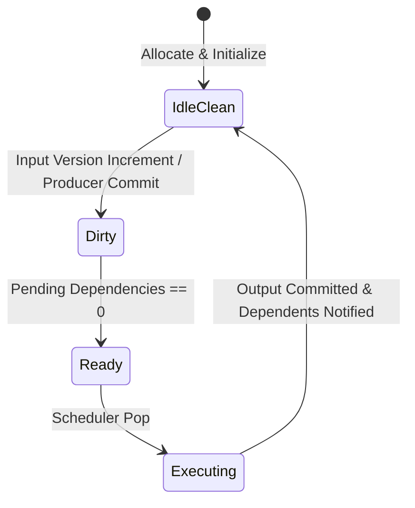

# TWRF Execution Semantics & Formal Invariants

**Scope:** Formal operational semantics for Temporal Work Region Fabric (TWRF)  
**Version:** 0.1 (Sub-Plan 1)

---

## 1. State Space & Lifecycle Transitions

Each TWR $T$ operates within a finite state machine:

### 1.1 Formal Invariants
1. **Invariant 1 (Lifecycle Cleanliness)**: Upon completion of execution and output commit, a TWR's recorded input version vector $\vec{v}_{\text{recorded}}$ must match the current versions of all bound resources:
   $$\vec{v}_{\text{recorded}}(T) = \vec{v}_{\text{current}}(\text{Inputs}(T))$$
2. **Invariant 2 (Monotonic Propagation)**: If a producer TWR $P$ finishes execution and updates its output version $V_{P} \to V_{P}'$, every direct consumer $C \in \text{Consumers}(P)$ must transition to `Dirty` if it was `IdleClean`.
3. **Invariant 3 (Readiness Soundness)**: A TWR $T$ shall never enter the `Ready` state while $\text{pending\_dependencies}(T) > 0$.
4. **Invariant 4 (Deterministic Step Order)**: Given identical initial graph states and identical sequence of resource mutations, the scheduler step function must yield an identical sequence of executed TWR IDs and output versions.

---

## 2. Invalidation Asymmetry & Oracle Rule

### 2.1 The Conservative Filter Principle
Let $\Delta$ be the true semantic delta of an input:
$$\text{IsModified}(R) \iff \text{Version}(R) > \text{RecordedVersion}(R)$$

If an external mutation provides a spatial bounding box $B_{\text{change}}$, the invalidation filter evaluates:
$$\text{Filter}(T) = B_{\text{change}} \cap \text{Region}(T) \neq \emptyset$$

* **Safe Over-estimation**: If $\text{Filter}(T) = \text{true}$ even when no pixel inside $T$ actually changes, $T$ re-executes. The final output is bitwise identical to the cached state. Correctness is preserved.
* **Prohibited Under-estimation**: If $\text{Filter}(T) = \text{false}$ while data inside $T$ has changed, $T$ is skipped, resulting in a **Stale State Hazard**. The test oracle must immediately assert and terminate execution.

---

## 3. Dependency Notification Protocol

When TWR $P$ executes:
1. $P$ executes its kernel function over current input buffers.
2. $P$ commits output payload to its dedicated slot in `LogicalStateStore`.
3. Output version $V_P$ increments: $V_P \leftarrow V_P + 1$.
4. For each consumer $C \in \text{Consumers}(P)$:
   - Update $C$'s recorded version for input $P$.
   - Mark $C$ as `Dirty`.
   - Decrement $C$'s pending dependencies: $\text{pending\_dependencies}(C) \leftarrow \text{pending\_dependencies}(C) - 1$.
   - If $\text{pending\_dependencies}(C) == 0$, push $C$ to `ReadyQueue`.
5. $P$ transitions to `IdleClean`.
