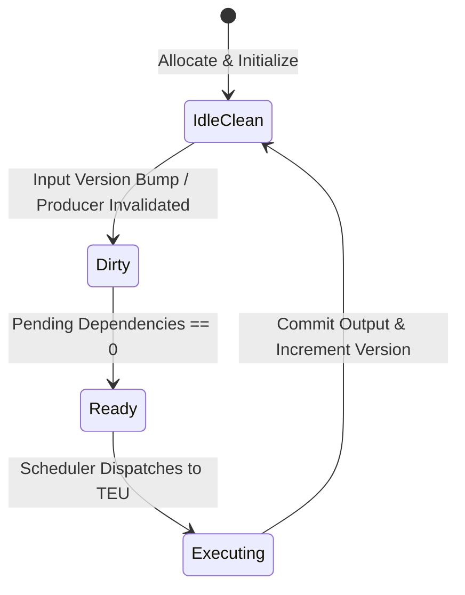
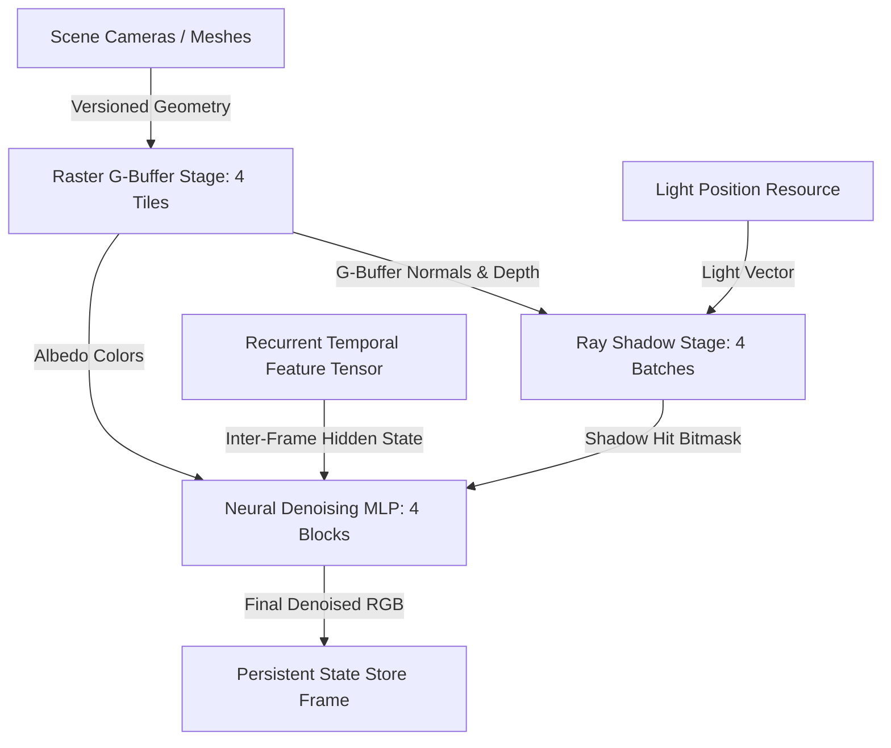

# TWRF Technical Manual & Architecture Methodology

**Document Class:** Comprehensive Engineering & Methodology Reference  
**Audience:** Hardware architects, graphics researchers, systems engineers  
**Companion Documents:** [README.md](../README.md), [TWRF_SPEC.md](TWRF_SPEC.md), [API_REFERENCE.md](API_REFERENCE.md)

---

## Table of Contents

1. [Architectural Principles & Problem Statement](#1-architectural-principles--problem-statement)
2. [Core Execution Primitive: Temporal Work Region (TWR)](#2-core-execution-primitive-temporal-work-region-twr)
3. [Change Detection & Conservative Invalidation Methodology](#3-change-detection--conservative-invalidation-methodology)
4. [Persistent Memory Architecture: The Logical State Store](#4-persistent-memory-architecture-the-logical-state-store)
5. [Deterministic Dataflow Scheduling & Dependency Resolution](#5-deterministic-dataflow-scheduling--dependency-resolution)
6. [Mathematical Cost Model & Analytical Derivations](#6-mathematical-cost-model--analytical-derivations)
7. [Heterogeneous Execution: Unifying Raster, Ray, and Neural Workloads](#7-heterogeneous-execution-unifying-raster-ray-and-neural-workloads)
8. [Microarchitectural Timing Model & Baseline Formulations](#8-microarchitectural-timing-model--baseline-formulations)
9. [Empirical Profiling & Detailed Overhead Attribution](#9-empirical-profiling--detailed-overhead-attribution)
10. [Hardware Synthesizability & FPGA Mapping](#10-hardware-synthesizability--fpga-mapping)

---

## 1. Architectural Principles & Problem Statement

### 1.1 The Inefficiency of Unconditional Recomputation
Modern real-time graphics architectures (NVIDIA Ada/Blackwell, AMD RDNA 3/4, Apple Silicon) are architected around massively parallel Single Instruction, Multiple Threads (SIMT) pipelines. A primary characteristic of this model is **unconditional frame-wide recomputation**:
- Every frame ($16.6\text{ ms}$ at 60 Hz or $8.3\text{ ms}$ at 120 Hz), the entire render graph—geometry transformation, tile binning, rasterization, G-buffer creation, shadow mapping, lighting evaluation, and post-processing—is executed from scratch.
- In typical interactive applications, games, and UI interfaces, between **$70\%$ and $95\%$ of screen-space regions remain visually identical** across consecutive frames (static backgrounds, idle characters, distant scenery).
- Discarding already-computed intermediate data every $16\text{ ms}$ represents an enormous, fundamental waste of dynamic energy and compute throughput.

### 1.2 The TWRF Proposition
**Temporal Work Region Fabric (TWRF)** fundamentally restructures the GPU pipeline around **persistent dataflow**:
1. Spatial work units retain their output buffers in on-chip SRAM across frame boundaries.
2. In-flight work units re-execute if and only if registered upstream inputs (matrices, transforms, textures, lights) have changed.
3. The scheduling engine determines execution eligibility **before** work reaches compute arithmetic logic units (ALUs).

---

## 2. Core Execution Primitive: Temporal Work Region (TWR)

The fundamental computational atom in TWRF is the **Temporal Work Region (TWR)**:

$$\text{TWR} = \langle \text{Id}, \mathcal{B}, \mathcal{K}, \mathcal{I}, \mathcal{O}, \mathcal{D}_{\text{in}}, \mathcal{D}_{\text{out}}, \mathcal{S}, \pi, \delta \rangle$$

- $\text{Id} \in \mathbb{N}$: Unique identifier across the entire execution fabric.
- $\mathcal{B} \in \mathbb{R}^4$: 2D or 3D bounding region (e.g. $[x_{\min}, y_{\min}, x_{\max}, y_{\max}]$ in screen-space).
- $\mathcal{K}$: Deterministic compute kernel function.
- $\mathcal{I} = \{(R_k, v_k)\}$: Input bindings pairing resource references $R_k$ with recorded version snapshots $v_k$.
- $\mathcal{O}$: Allocated persistent output address/slot in the Logical State Store.
- $\mathcal{D}_{\text{in}} \subset \mathbb{N}$: Upstream producer TWRs whose outputs are direct inputs.
- $\mathcal{D}_{\text{out}} \subset \mathbb{N}$: Downstream consumer TWRs that depend on this TWR's output.
- $\mathcal{S} \in \{\text{IdleClean}, \text{Dirty}, \text{Ready}, \text{Executing}\}$: FSM execution state.
- $\pi \in \mathbb{Z}$: Priority rank (higher values dispatched first).
- $\delta \in \mathbb{N}$: Topological depth in the DAG (deeper nodes dispatched first).



---

## 3. Change Detection & Conservative Invalidation Methodology

### 3.1 Why Delta Hashing Was Rejected
Earlier exploratory graphics research suggested computing 64-bit to 256-bit hashes (e.g. xxHash, SpookyHash) of tile buffers to detect inter-frame changes. In TWRF, hash-based change detection is strictly banned based on the following architectural proof:
- In a 1080p frame ($1920 \times 1080$), reading a 32-bit color buffer plus 32-bit depth buffer requires reading:
  $$1920 \times 1080 \times 8\text{ bytes} \approx 16.59\text{ MB per pass}$$
- Reading and hashing $16.59\text{ MB}$ at 60 FPS consumes $\approx 1\text{ GB/s}$ of internal memory bandwidth simply to decide whether to recompute.
- For lightweight or medium-complexity shaders, the cost of reading memory to hash a region exceeds the cost $C_r$ of recomputing the pixels directly!
- Therefore, hashing invalidates the core inequality $C_t \ll C_r$.

### 3.2 Monotonic Version Vectors + Conservative Spatial Filtering
TWRF replaces hashing with an $O(1)$ scalar versioning protocol:
1. Every input resource $R$ maintains a monotonically increasing 64-bit integer version counter $V(R)$ and a bounding volume $B(R)$.
2. When the CPU or upstream stage mutates $R$, it executes:
   $$V(R) \leftarrow V(R) + 1, \quad B_{\text{change}}(R) \leftarrow B_{\text{old}} \cup B_{\text{new}}$$
3. **Change Detection Rule:** A TWR $T$ is eligible for temporal reuse if and only if:
   $$\forall (R_k, v_k) \in \mathcal{I}(T): V(R_k) = v_k \quad \lor \quad \left( B_{\text{change}}(R_k) \cap \mathcal{B}(T) = \emptyset \right)$$
4. **Conservative Invalidation Principle:**
   - **Safe Over-estimation:** If $B_{\text{change}} \cap \mathcal{B}(T) \neq \emptyset$, $T$ re-executes even if the mutated geometry did not physically hit a pixel inside $T$. Output is bitwise identical to clean cache. Correctness is fully preserved.
   - **Forbidden Under-estimation:** Marking a changed region clean produces stale visual artifacts (Stale State Hazard). The test oracle asserts and halts simulation immediately.

---

## 4. Persistent Memory Architecture: The Logical State Store

### 4.1 Memory Model
Conventional GPUs feature on-chip Tile Memory (e.g. in TBDR architectures like Apple Silicon or ARM Mali) that is transient: it is allocated for the duration of a tile pass and flushed to DRAM at the end of the frame.

TWRF models a persistent on-chip **Logical State Store**:
- **Dual-Port Banked SRAM:** Modeled with independent read and write ports.
  - Port A (Write): Active Tile Execution Units (TEUs) stream committed color/depth/hit payloads.
  - Port B (Read): Downstream consumer TWRs or the final display scanout raster engine stream cached intermediate data.
- **Inter-Frame Persistence:** State does not evaporate at V-Sync. Clean tiles remain resident indefinitely until explicitly invalidated.
- **Configurable Hardware Parameters:**
  - `capacity_bytes`: Total physical SRAM budget (e.g., 1 MB to 64 MB).
  - `read_latency_per_byte` ($0.05\text{ cycles/byte}$) and `write_latency_per_byte` ($0.08\text{ cycles/byte}$).
  - `dram_spill_penalty_per_byte` ($0.5\text{ cycles/byte}$): Charged when active working sets exceed physical SRAM limits.

---

## 5. Deterministic Dataflow Scheduling & Dependency Resolution

### 5.1 Dynamic Dependency Pruning (`prepare_frame`)
A key challenge in persistent dataflow is that **clean upstream producers do not execute**:
- If a downstream node $C$ has upstream dependencies $\mathcal{D}_{\text{in}}(C) = \{P_1, P_2\}$, but $P_1$ is clean and will not execute this frame, $P_1$ will never emit an "execution finished" event.
- If $C$ statically waited for 2 events, it would deadlock!
- **TWRF Solution:** The scheduler runs `prepare_frame()` before dispatch:
  1. Computes the active execution set:
     $$\mathcal{W} = \{ T \in \text{Graph} \mid \text{is\_dirty}(T) \}$$
  2. For every dirty node $C \in \mathcal{W}$, counts only active upstream dependencies:
     $$\text{pending\_dependencies}(C) \leftarrow \left| \mathcal{D}_{\text{in}}(C) \cap \mathcal{W} \right|$$
  3. If $\text{pending\_dependencies}(C) == 0$, $C$ is inserted directly into the Ready Queue.

### 5.2 Deterministic Three-Tier Tie-Breaking
To prevent non-deterministic race conditions or schedule divergence across simulator runs:
$$\text{Order}(T_A, T_B) = \begin{cases}
T_A \succ T_B & \text{if } \pi(T_A) > \pi(T_B) \\
T_A \succ T_B & \text{if } \pi(T_A) = \pi(T_B) \land \delta(T_A) > \delta(T_B) \\
T_A \succ T_B & \text{if } \pi(T_A) = \pi(T_B) \land \delta(T_A) = \delta(T_B) \land \text{Id}(T_A) < \text{Id}(T_B)
\end{cases}$$

This guarantees bitwise-identical execution traces across platforms and threads.

---

## 6. Mathematical Cost Model & Analytical Derivations

### 6.1 Formal Derivation of the Correct Break-Even Boundary
Let:
- $C_r \in \mathbb{R}^+$: Recomputation cost of a region.
- $C_t \in \mathbb{R}^+$: Tracking, scheduling, and validation overhead of a region.
- $p \in [0, 1]$: Probability that a region changes in a frame (scene volatility).

Expected cost formulations:
- **Baseline A (SIMT Full Recompute):** Executes unconditionally every frame:
  $$E[\text{Baseline}] = C_r$$
- **TWRF (Persistent Dataflow):** Incurs tracking overhead $C_t$ unconditionally, plus recomputation cost $C_r$ with probability $p$:
  $$E[\text{TWRF}] = C_t + p \cdot C_r + (1 - p) \cdot 0 = C_t + p \cdot C_r$$

For TWRF to achieve net performance gain over the baseline:
$$E[\text{TWRF}] < E[\text{Baseline}]$$
$$C_t + p \cdot C_r < C_r$$
$$p \cdot C_r < C_r - C_t$$
Dividing by $C_r$ (since $C_r > 0$):
$$\mathbf{p < 1 - \frac{C_t}{C_r}}$$

The critical crossover point $p^*$ occurs when:
$$\mathbf{p^* = 1 - \frac{C_t}{C_r}}$$

### 6.2 Formal Rejection of the Inverted Formula
Early exploratory literature contained the erroneous equation:
$$p > \frac{C_t}{C_r} \quad [\text{REJECTED}]$$

**Proof of Invalidation:**
- If $p > C_t / C_r$ held true, then as $p \to 1.0$ (100% of regions changing), TWRF would become *more* advantageous.
- But at $p = 1.0$, TWRF performs 100% of the recomputation work ($C_r$) **in addition to** paying the tracking overhead ($C_t$):
  $$E[\text{TWRF}]_{p=1.0} = C_r + C_t > C_r$$
- In reality, TWRF is strictly worse than baseline by exactly $C_t$ when $p=1.0$.
- Under the correct formulation $p < 1 - C_t / C_r$, when $p = 1.0$, $1.0 < 1 - C_t / C_r \implies C_t / C_r < 0$, which is impossible for positive costs. Thus, TWRF provably loses as $p \to 1.0$.

---

## 7. Heterogeneous Execution: Unifying Raster, Ray, and Neural Workloads

Rather than dispatching disjoint co-processors with driver barriers, TWRF models a unified DAG pipeline:



- **Cross-Domain Invalidation Case Study:**
  - If a light moves, `LIGHT` increments its version number.
  - The Change Tracker observes that `RAST` tiles do not depend on `LIGHT`; `RAST` tiles are declared **Clean** and skipped ($0$ cycles).
  - `RAY` batches depend on `LIGHT` and are marked **Dirty**; they re-trace shadow rays.
  - `NEUR` blocks depend on `RAY` outputs; they detect dirty upstream dependencies and re-execute.
  - **Result:** Exact, fine-grained cross-stage invalidation with zero host CPU driver intervention.

---

## 8. Microarchitectural Timing Model & Baseline Formulations

### 8.1 Cycle Attribution Equation
Total simulator cycles per frame are partitioned across five mutually exclusive components:
$$C_{\text{total}} = C_{\text{change\_detect}} + C_{\text{schedule}} + C_{\text{execution}} + C_{\text{state\_store}} + C_{\text{interconnect}}$$

| Component | Hardware Unit | Modeling Formulation |
| :--- | :--- | :--- |
| $C_{\text{change\_detect}}$ | Scoreboard / Comparator | $\sum_{T} (5 \cdot |\mathcal{I}(T)|) + \sum_{R \in \Delta} (10 \cdot |\text{overlapping } T|)$ |
| $C_{\text{schedule}}$ | Priority Queue Logic | $15 \cdot N_{\text{pushes}} + 15 \cdot N_{\text{pops}}$ |
| $C_{\text{execution}}$ | Tile Execution Unit (ALU) | Kernel ALU cycles + memory load + texture bilinear cycles |
| $C_{\text{state\_store}}$ | Dual-Port Banked SRAM | $0.05 \cdot \text{Bytes}_{\text{read}} + 0.08 \cdot \text{Bytes}_{\text{written}}$ |
| $C_{\text{interconnect}}$ | 2D Mesh NoC | $3.0 \cdot \sum \text{ManhattanHops}(T_{\text{TEU}}, \text{Bank})$ |

### 8.2 Baseline Formulations
1. **Baseline A (SIMT Full Recomputation):**
   - Modeled after standard desktop GPUs.
   - $C_t = 0$ (No tracking, no scoreboard, no version comparison).
   - $C_r = \sum_{T \in \text{All}} C_{\text{exec}}(T) + C_{\text{write}}(T)$.
   - Re-executes unconditionally on every frame.
2. **Baseline B (Conventional Post-Process Temporal Cache):**
   - Modeled after software-level reprojection buffers (e.g., TAA / FSR style).
   - Pays a fixed per-tile tag check latency plus cache hit/miss read penalties.

---

## 9. Empirical Profiling & Detailed Overhead Attribution

Under standard evaluation parameters ($128 \times 128$ resolution, 64 tiles of $16 \times 16$ pixels):

```
Cycles
  ▲
45k │                                                        ● TWRF (44,182)
40k │                                                  ▲
35k │                                            ●     │ Worst-case tax: +176.4%
30k │                                      ▲           │
25k │                                ●     │           ▼
20k │                          ●     ───────────────────── Baseline A (15,984)
15k │  ●--------●--------●           
10k │  │ Break-even p* ≈ 13%
 5k │  ▼ 1.83x Speedup (8,716)
 0k └──┴────────┴────────┴─────┴─────┴─────┴─────┴─────────► Change Rate p
      0%       5%       10%   25%   50%   75%   100%
```

### Detailed Measured Breakdown

| Scene Volatility ($p$) | $C_{\text{change}}$ | $C_{\text{sched}}$ | $C_{\text{exec}}$ | $C_{\text{state}}$ | $C_{\text{noc}}$ | TWRF Total | Baseline A | Speedup / Tax |
| :---: | :---: | :---: | :---: | :---: | :---: | :---: | :---: | :---: |
| **$0\%$ (Static)** | 5,440.0 | 0.0 | 0.0 | 3,276.8 | 0.0 | **8,716.8** | 15,984.0 | **1.83x WIN** |
| **$5\%$** | 7,488.0 | 120.0 | 799.2 | 3,923.2 | 36.0 | **13,906.4** | 15,984.0 | **1.15x WIN** |
| **$10\%$** | 8,128.0 | 120.0 | 799.2 | 3,923.2 | 36.0 | **14,546.4** | 15,984.0 | **1.10x WIN** |
| **$25\%$** | 12,224.0 | 240.0 | 1,598.4 | 4,569.6 | 72.0 | **20,364.0** | 15,984.0 | **+27.4% LOSS** |
| **$50\%$** | 14,784.0 | 240.0 | 1,598.4 | 4,569.6 | 72.0 | **22,924.0** | 15,984.0 | **+43.4% LOSS** |
| **$75\%$** | 21,952.0 | 360.0 | 2,397.6 | 5,216.0 | 108.0 | **31,365.6** | 15,984.0 | **+96.2% LOSS** |
| **$100\%$ (Worst)** | 15,680.0 | 1,920.0 | 15,984.0 | 9,742.4 | 576.0 | **44,182.4** | 15,984.0 | **+176.4% LOSS** |

---

## 10. Hardware Synthesizability & FPGA Mapping

For physical RTL implementation details, refer to [`FPGA_FEASIBILITY.md`](FPGA_FEASIBILITY.md).

- **Demonstrable Prototype Subset:** Single-Tile TWR Fabric Core with 64-entry metadata scoreboard, prioritized ready queue, 1 MB dual-port UltraRAM State Store, and 16-lane fixed-point SIMD ALU.
- **Estimated Resource Footprint (AMD Xilinx UltraScale+ ZCU102):**
  - LUTs: **33,300** (~12.1% utilization).
  - Flip-Flops: **26,800** (~4.9% utilization).
  - DSP Slices: **64** (~2.5% utilization).
  - Block RAM: **32** (~3.5% utilization).
  - UltraRAM: **24** (1 MB SRAM memory bank).
